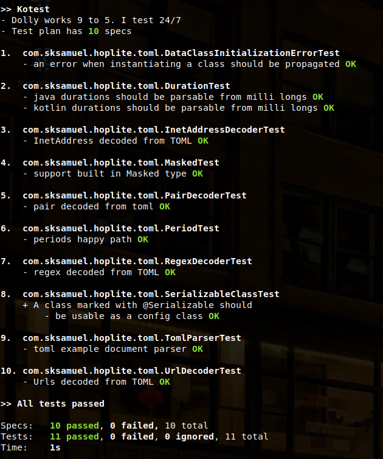
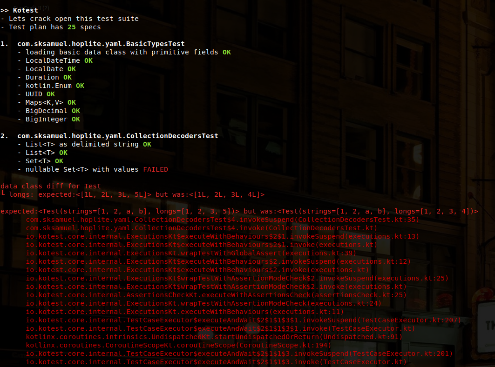
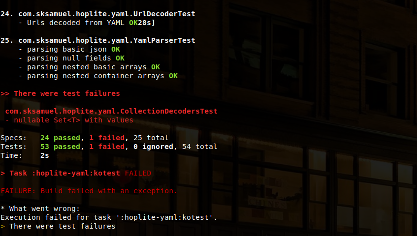

# kotest-gradle-plugin


[Gradle plugin](https://plugins.gradle.org/plugin/io.kotest) for running JVM tests with Kotest. Requires Kotest 4.2.6 or a snapshot 4.3.0 build.

This is an alternative to using JUnit5 support and provides better output than the gradle default, especially for nested tests. 


### How to use

Add the plugin to your gradle build file:

```kotlin
plugins {
     id("io.kotest") version "0.2.6"
}
```

Then execute the tests at the command line using the `kotest` task.

```bash
./gradlew kotest
```

Or from within intellij under the gradle -> tasks -> verification -> kotest task.


### Example Output



Another example with failure:



Errors are again summarized at the end for easy digesting:


